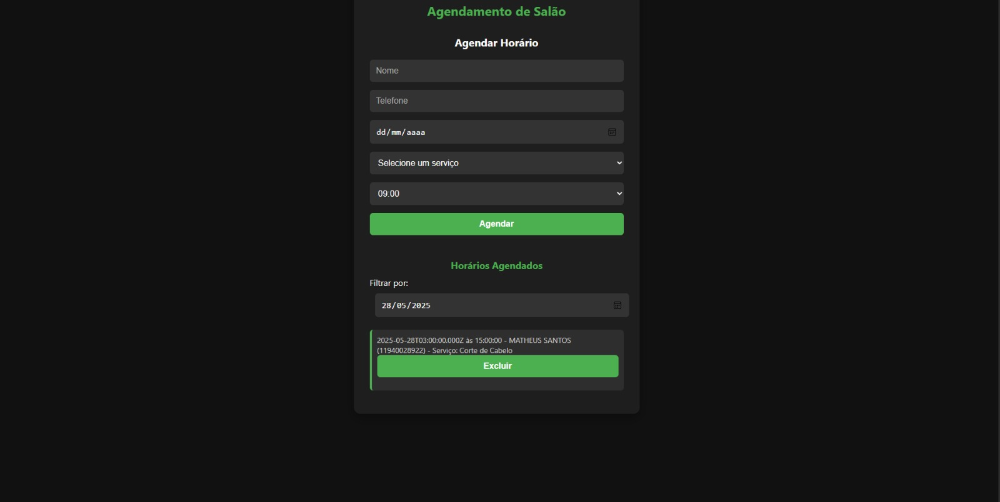
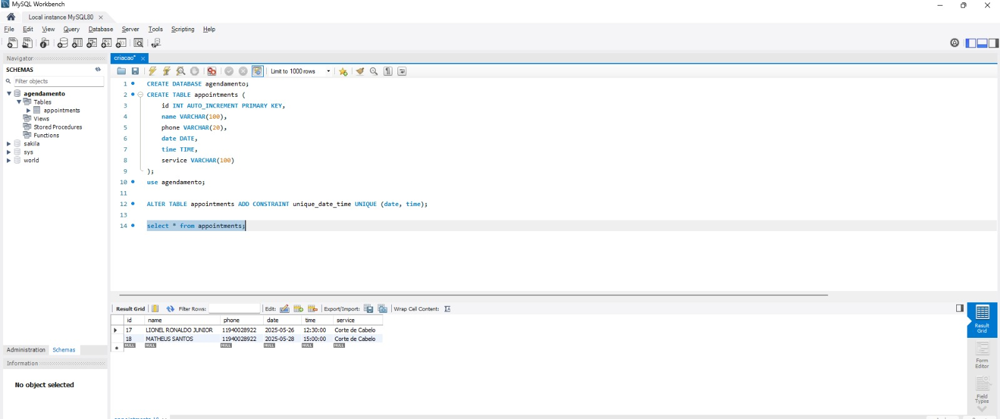

# Projeto de Sistema de Agendamento para Salão de Cabeleireiro

Este relatório apresenta o desenvolvimento e os resultados do projeto de criação de uma solução digital voltada à otimização do processo de agendamento de serviços em um salão de cabeleireiro.

A iniciativa partiu da constatação de deficiências nos métodos manuais utilizados por pequenos empreendedores do setor, que enfrentam desafios relacionados à organização, imprecisão nos agendamentos e sobrecarga operacional.

A motivação surgiu a partir da observação de um dos integrantes do grupo, **Matheus Fernandes Santos**, ao visitar o salão de seu primo e identificar falhas recorrentes no controle dos agendamentos realizados manualmente. A receptividade do proprietário diante da proposta permitiu o levantamento de requisitos reais e proporcionou um entendimento aprofundado das necessidades do negócio.

O projeto foi desenvolvido no contexto do **Projeto Integrador (PI)** da **UNIVESP**, com o objetivo de aplicar, na prática, os conhecimentos adquiridos ao longo do curso, utilizando a metodologia do **Design Thinking** para promover uma solução centrada no usuário. A proposta visou não apenas solucionar um problema técnico, mas também contribuir com a transformação digital de um pequeno empreendimento.

A solução desenvolvida busca **automatizar o processo de agendamento**, reduzindo erros, otimizando o tempo de atendimento e proporcionando maior comodidade aos clientes por meio de uma **interface intuitiva e acessível**.

Este relatório detalha as **etapas do desenvolvimento**, as **tecnologias utilizadas** e os **resultados alcançados** com a implementação do sistema.

---

## 📸 Demonstrações

### Tela de Agendamento

<!-- Exemplo: substitua 'imagens/agendamento.png' pelo caminho correto da imagem -->

### Banco de Dados

---

## Tecnologias Utilizadas

- **HTML5**: Estruturação da interface e páginas do sistema.
- **CSS3**: Design responsivo e acessível para múltiplos dispositivos.
- **JavaScript**: Funcionalidades dinâmicas, controle e validação de horários.
- **Node.js**: Backend para processamento das requisições e integração com o banco de dados.
- **MySQL**: Armazenamento seguro de agendamentos e histórico.
- **GitHub**: Versionamento de código e colaboração em equipe.

---

## Objetivos do Projeto

✅ Automatizar o processo de agendamento  
✅ Reduzir erros operacionais  
✅ Otimizar o tempo de atendimento  
✅ Proporcionar maior comodidade aos clientes  
✅ Contribuir para a transformação digital de pequenos negócios  

---

## Metodologia

O desenvolvimento foi orientado pelo **Design Thinking**, seguindo as etapas de:

1. **Imersão**: Entendimento profundo do contexto e levantamento de necessidades.
2. **Ideação**: Geração de soluções criativas para os desafios identificados.
3. **Prototipagem**: Desenvolvimento de uma solução funcional.
4. **Testes**: Validação com o usuário final e ajustes baseados no feedback.

---

## Status do Projeto
 
✅ **Concluído**  

---

## Como Contribuir

1. Fork este repositório.
2. Crie uma branch: `git checkout -b feature/NovaFuncionalidade`.
3. Faça suas alterações e commit: `git commit -m 'Adiciona nova funcionalidade'`.
4. Push na branch: `git push origin feature/NovaFuncionalidade`.
5. Abra um Pull Request.

---

## Contato

Em caso de dúvidas ou sugestões, entre em contato:  
**Matheus Fernandes Santos**  
  
<!-- Link para seu perfil -->

---

> Projeto desenvolvido como parte das atividades acadêmicas da **UNIVESP** – Universidade Virtual do Estado de São Paulo.
